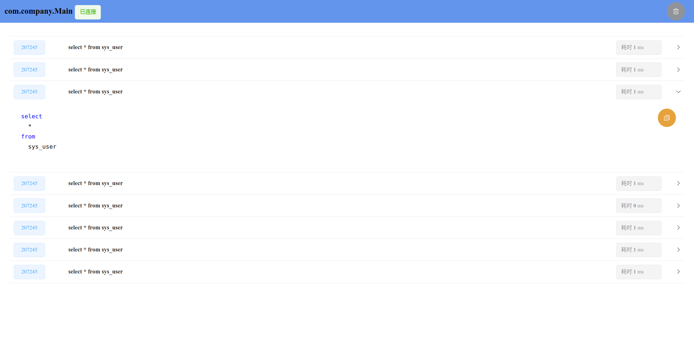

### jdbc 监控

使用agent的方式监控当前java 程序的 sql 执行情况，并计算执行时间 

目前只支持 mysql5.* 和8.* 的驱动程序，如果想支持其他 sql,
参见 `monitor-agent`模块下的 `xyz.thetbw.monitor.jdbc.agent.transformers`包

#### 使用方法
* server模式
  * 下载release jar文件
  * `java -jar xxx.jar`执行下载的jar 文件
  * 在打开浏览器(或者手动打开 http://127.0.0.1:10086),选择需要监控的程序
  * 注： 需要监控的程序需要使用的是 mysql 5.* 或 8.*的驱动，不然会连接失败
* agent模式
  * 下载 release jar文件
  * 在你启动程序的时候，添加vm参数 `-javaagent:release.jar`,其中release.jar为下载的jar文件，请替换成你的实际路径
  * 打开 http://127.0.0.1:10086 查看监控数据

#### 目前并不算完善，没有完整测试，目前已知以下问题

* 连接过程中如果本服务器断开，就不能再次连接了，必须重启目标程序
* 和上个问题类型，断开连接后会恢复被修改的class,不过可能并未清理干净
* 目前仅在 oracle jdk8 上测试通过，其他版本可能连接失败
* 在windows上出现过不显示进程列表的问题，jps也不显示进程列表，应该是jvm的问题，把jar包从d盘复制到桌面莫名又好了
* 过长的sql显示不全

#### 后续计划 (如果有空的话)
- [ ] 基本的bug修复
- [ ] 反射获取数据优化
- [ ] sql执行出错，执行超时的问题处理
- [ ] ui 优化
- [ ] 端口号设置与嵌入到springboot中

#### 自行编译
* 前提你已经有`java`环境和`nodejs`环境
* 再 monitor-ui 目录下 `npm install` 安装依赖,然后 `npm run build` 编译
* 将编译后的`dist`目录下的文件 复制到 `monitor-server` `resource/static`目录下
* 编译 `monitor-server` `mvn install`
* 编译 `monitor-agent` `mvn install`
* 编译后的文件在 `monitor-agent` `target`目录下

#### 其他 
> 原本开发这个程序的目的是方便开发过程中复制正在执行的sql，用于排查问题。然后看了mysql驱动的源码才发现mysql驱动自带性能监控，
> spring 也可以使用好几种方式来打印执行的 sql 😂

#### Changelog

* 0.0.2 新增了agent模式，其他问题修复
